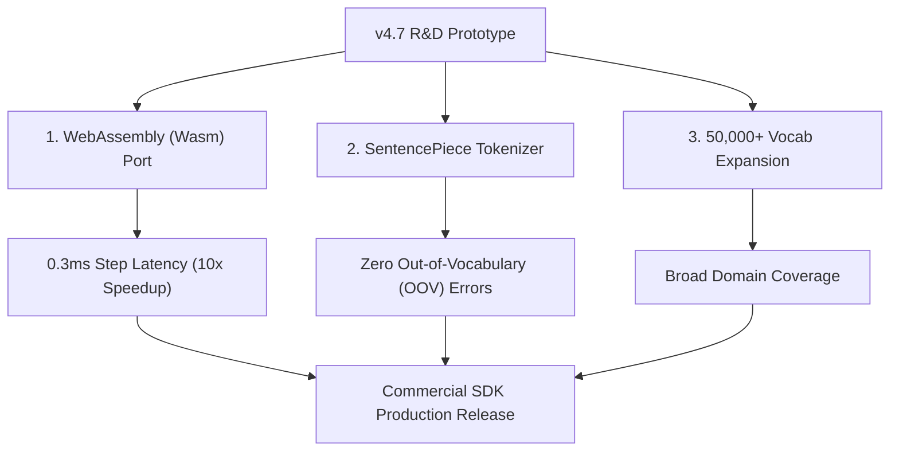

# COMMERCIALIZATION & TECHNICAL ROADMAP: TURKISH RESONANCE AI CORE
## Monetizing Low-Power Spectral-HDC Language Architectures

**Executive Summary:**
Standard LLMs require massive cloud capital expenditure (CapEx) and operational expenditure (OpEx) due to GPU cluster demands. The Turkish Resonance AI Core (v4.7) breaks this paradigm by executing next-token predictions in $O(D \log D)$ time utilizing under 20 MB of RAM. This document outlines the shortest path to monetization, infrastructure requirements (or lack thereof), and the roadmap to product perfection.

---

## 1. Monetization: The Shortest Paths to Revenue

### A. Edge AI & Mobile SDK Licensing (B2B SaaS)
*   **The Play:** Package the `/core` engine as a highly optimized mobile SDK (iOS/Android) or WebAssembly library. 
*   **Target Customers:** Mobile app developers building offline translation apps, smart keyboard apps, local voice assistants, and IoT/smart-home device manufacturers.
*   **Revenue Model:** Per-device licensing fee (e.g., $0.05 per active installation per month). Since the model runs locally on the phone's CPU/NPU, our operational cost is $0, meaning **100% gross margin**.

### B. On-Premise Enterprise Chatbots (Low-Power B2B)
*   **The Play:** Deploy the model locally on standard office server CPUs for private enterprise search and query routing.
*   **Target Customers:** Banks, hospitals, and legal firms that cannot upload sensitive data to third-party clouds (OpenAI/Anthropic) and cannot afford renting private H100 servers (costing $5,000+/month).
*   **Revenue Model:** One-time installation/customization fee ($10,000 - $50,000) + annual maintenance contract (20% of initial fee).

### C. LLM Distillation SaaS (B2B API)
*   **The Play:** Offer a cloud compiler service. Companies upload their large, expensive-to-run models (e.g., LLaMA 8B, TURNA 1.1B), and we compile them into our $O(D \log D)$ FHRR phase-space representation.
*   **Revenue Model:** Pay-per-model-distilled.

---

## 2. Infrastructure: Do We Need a Data Center or Cloud?

### The Short Answer: NO.
Unlike traditional LLMs, our architecture has **virtually zero cloud infrastructure requirements**.

*   **Zero Server-Side Inference Costs:** If deployed as a web application, the model can run entirely **client-side (browser-side)** using JavaScript/WebAssembly. The user's own computer/phone executes the FFT circular convolutions. 
*   **Penny-Hosting:** We only need to host static HTML/JS files, which can be done for free or pennies via platforms like Vercel, Netlify, or GitHub Pages. No expensive GPU dev servers, no database clustering, and no massive electricity bills.
*   **Ultra-Fast Training:** Learning transitions in HDC phase-space is done via phase difference bundling. This runs on a standard laptop CPU in **seconds** (no multi-million dollar GPU training clusters required).

---

## 3. Technical Roadmap to Product Perfection

To elevate this R&D prototype into a dominant global product, we must execute the following enhancements:

### 1. WebAssembly (Wasm) Porting
*   **What:** Rewrite `/core/hdc.js` and `/core/fft.js` in Rust or C++ and compile to WebAssembly.
*   **Why:** JavaScript is single-threaded and has JIT warm-up latency. A native Wasm module will drop the step latency from 2.8ms to **under 0.3ms** (10x faster), allowing immediate, lag-free execution on any edge device.

### 2. SentencePiece / BPE Tokenizer Integration
*   **What:** Replace whitespace splitting with a proper subword tokenizer trained on Turkish suffix boundaries.
*   **Why:** It allows the model to handle unseen/unknown words gracefully by breaking them down into morphemes, completely eliminating out-of-vocabulary (OOV) errors.

### 3. Vocabulary & Corpus Expansion
*   **What:** Expand training using the full Turkish Wikipedia dataset to scale up to 50,000+ words.
*   **Why:** Proves the model's capacity to handle complex, broad-domain semantics while maintaining $O(D \log D)$ circular convolution efficiency.

### 4. Silicon-Level Co-Design (Hardware ASIC/FPGA)
*   **What:** Design a custom hardware accelerator block for the FFT circular convolution.
*   **Why:** Since operations are only FFT and pointwise complex Hadamard products, a dedicated silicon block can run this model at micro-watt levels, making it the default processor block for next-gen IoT and mobile devices.
