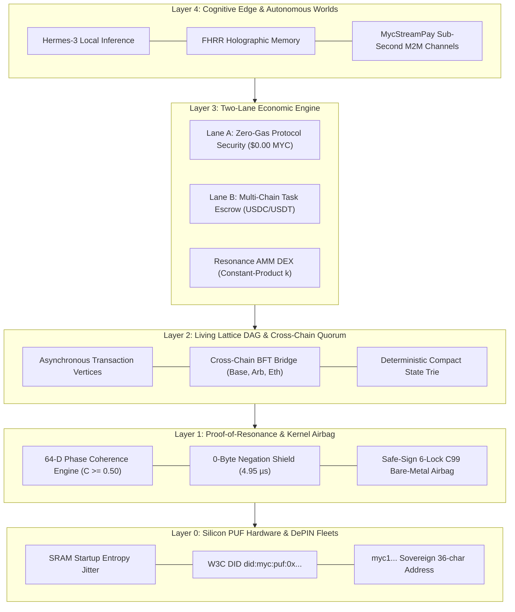
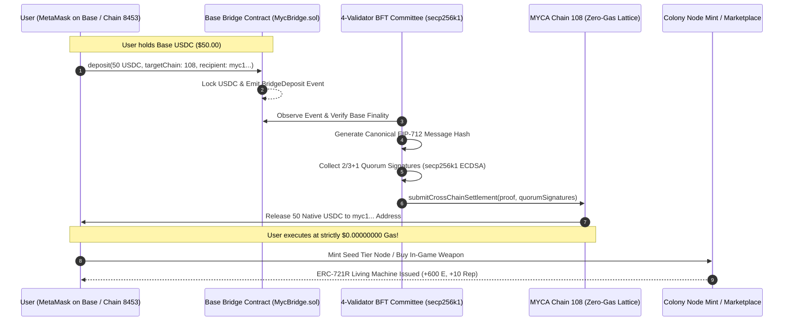

# 🚀 MYCA NETWORK: INVESTOR PITCH DECK & EXECUTIVE COMPENDIUM
### Sovereign Cognitive Infrastructure, Zero-Gas Living Lattice DAG, Silicon PUF DePIN & Autonomous Machine Economy
**Network ID:** `Chain 108 (MYC-LATTICE-MAINNET)` | **Release:** `v3.5.0-PROD` | **Confidential & Proprietary**

---

```
       _____ ___   __  __ _____     ___  ____ ____ _   _ 
      |  ___/ _ \ |  \/  | ____|   / _ \| __ ) ___| | | |
      | |_ | | | || |\/| |  _|    | | | |  _ \ |   | |_| |
      |  _|| |_| || |  | | |___   | |_| | |_) | |___|  _  |
      |_|   \___/ |_|  |_|_____|   \___/|____/\____|_| |_|
   MYCELIAL COGNITIVE ARCHITECTURE & LIVING MACHINE DEPIN
```

---

## SLIDE 1: THE EXECUTIVE THESIS

> **"The next century does not belong to human-to-human finance. It belongs to trillions of autonomous machines, edge AI agents, and persistent gaming worlds transacting, deciding, and operating at the speed of silicon."**

* **Core Innovation:** The world's first **Zero-Gas Living Lattice DAG** featuring **Silicon PUF Root-of-Trust**, **4.95 µs Bare-Metal Hardware Safety Interlock (Safe-Sign)**, and **Living Machine NFTs (ERC-721R)**.
* **The Paradigm Shift:** Traditional blockchains treat hardware as passive dumb nodes and NFTs as dead static JPEGs. MYCA turns every machine and game asset into a **living, revenue-generating economic organism** with dynamic energy, harmonic frequency bonding, and autonomous on-chain cash flows.

---

## SLIDE 2: THE MULTI-TRILLION DOLLAR MARKET CONVERGENCE

```
TOTAL ADDRESSABLE MARKET (2025 - 2032 CAGR: +34.2%)
┌────────────────────────────────────────────────────────────────────────┐
│ [1] DePIN Infrastructure & Industrial IoT Fleets:     $3.50 Trillion   │
│ [2] Autonomous AI Agent Economy & M2M Payments:       $1.85 Trillion   │
│ [3] Web3 Autonomous Worlds & High-Frequency Gaming:   $650 Billion     │
│ [4] Micro-Edge Compute, Industrial PLC & Telemetry:   $850 Billion     │
│ TOTAL TAM:                                            $6.85 TRILLION   │
└────────────────────────────────────────────────────────────────────────┘
```

Three massive secular waves are converging at this exact moment:
1. **Physical Infrastructure decentralization (DePIN):** Energy grids, telecom towers, EV chargers, and robotics need trustless machine-to-machine coordination.
2. **Autonomous AI Agents:** Small Language Models (SLMs) running on edge microchips need to buy compute, negotiate bandwidth, and execute real-world actuation without human intervention.
3. **Autonomous Gaming Worlds & On-Chain Simulation:** Persistent games require 60+ action ticks per second, sovereign NPCs with persistent memory, and living digital assets that evolve with gameplay.

---

## SLIDE 3: THE 4 FATAL FAILURES OF EXISTING L1/L2 BLOCKCHAINS

Existing networks (Ethereum, Solana, Peaq, IoTeX, ImmutableX) were built for human wallets and financial speculation. When applied to machines, robotics, and real-time games, they fail catastrophically:

```
TRADITIONAL BLOCKCHAINS (PEAQ / ETH / IMX) vs. INDUSTRIAL & GAMING REALITY
┌─────────────────────────────────────────┐     ┌─────────────────────────────────────────┐
│     EXISTING CRYPTO ARCHITECTURES       │     │     REAL-WORLD INDUSTRIAL & GAMING      │
├─────────────────────────────────────────┤     ├─────────────────────────────────────────┤
│ • Volatile Gas Fees ($0.001 - $25/tx)   │ VS  │ • Machines & Games need $0.00000000 gas │
│ • Multi-Second Block Times (2s - 12s)   │     │ • Physical valves & games need <5 µs    │
│ • Private Keys stored in flash/disk     │     │ • Physical edge hardware gets stolen    │
│ • Static 'Dead' NFTs (Frozen JPEGs)     │     │ • Real assets have energy & cash flow   │
│ • Total WAN / Cloud LLM Dependence      │     │ • Mines, towers & games need offline P2P│
└─────────────────────────────────────────┘     └─────────────────────────────────────────┘
```

1. **The Gas Pricing Paradox:** A drone or in-game bullet cannot hold and rebalance volatile gas tokens. If gas runs out, the physical machine halts or the player disconnects.
2. **Execution Latency vs. Physical Dynamics:** A high-pressure gas valve or industrial turbine cannot wait 6 to 12 seconds for block confirmation. It needs sub-5 microsecond physical emergency braking.
3. **Silicon Key Vulnerability:** Storing raw private keys on disk or microcontroller flash in outdoor physical hardware invites hardware side-channel extraction and cloning.
4. **The Static NFT Dead-End:** Traditional ERC-721 tokens represent idle, passive metadata. They cannot reflect machine degradation, task yields, live telemetry, or in-game experience.

---

## SLIDE 4: THE MYCA SOLUTION — A 5-LAYER SOVEREIGN STACK



* **Silicon PUF Root-of-Trust (`did:myc:puf:0x...`):** Cryptographic keys are derived on the fly from microscopic wafer crystal manufacturing variations. Zero private keys saved to disk. Unclonable.
* **4.95 µs C99 Safe-Sign Bare-Metal Airbag:** 240 bytes of static RAM, 0 dynamic allocations (`malloc = 0`). Drops destructive AI hallucinations and prompt injection attacks in 743 clock cycles before physical Modbus actuation.
* **Living Lattice DAG:** Asynchronous, mempool-free Directed Acyclic Graph delivering **strictly $0.00000000 gas fees** and instant single-hop vertex confirmations.
* **Proof-of-Resonance (PoR):** Zero energy waste; consensus is driven by mathematical phase coherence, physical telemetry proofs, and harmonic frequency synchronization.

---

## SLIDE 5: GAMING & AUTONOMOUS WORLDS — THE LIVING NFT ENGINE

Web3 GameFi collapsed because games forced players to pay gas for every move, and NFTs were static items traded on external marketplaces like OpenSea without gameplay connection. 

**MYCA transforms gaming through 5 breakthrough pillars:**

```
MYCA LIVING GAMING SUBSTRATE
┌────────────────────────────────────────────────────────────────────────┐
│ [1] Living NPCs with Local FHRR Memory ($0.00 Cloud LLM Cost)          │
│ [2] Deterministic Zero-Gas Action Ticks (60+ FPS on Living Lattice)    │
│ [3] Dynamic Living Game Assets (ERC-721R: Energy, Experience & Decay)  │
│ [4] Sub-Second M2M Micro-Streaming (MycStreamPay for Ammo/Energy)      │
│ [5] Mathematical Anti-Cheat via Phase Coherence (C >= 0.50 in <38.4 µs) │
└────────────────────────────────────────────────────────────────────────┘
```

### 1. Living Sovereign NPCs (Persistent Air-Gapped Intelligence)
* In-game NPCs possess autonomous `did:myc:puf:0x...` identities and **Fractional Holographic Real Representations (FHRR)**.
* NPCs remember player interactions, betrayals, and trade history locally in high-dimensional vector memory.
* **Cost Advantage:** $0.00 cloud API bills. No OpenAI/Anthropic subscription required; inference runs locally on the node or edge client.

### 2. Zero-Gas Action Ticks (60+ FPS Substrate)
* In traditional Web3, firing a laser, crafting an item, or trading ammunition requires paying gas fees and waiting for block confirmations.
* On MYCA Chain 108, player actions, bullet physics ticks, and inventory updates are broadcast directly to the Living Lattice DAG at **strictly 0.00000000 MYC gas**.

### 3. Dynamic Living Assets (ERC-721R Game Assets)
* **Energy Accumulation:** In-game swords, starships, and mechs gain vitality ($\Delta \mathcal{E} > 0$) with every battle, quest, and player telemetry tick.
* **Temporal Entropy Decay:** If a rare weapon is hoarded or abandoned for $>30$ days, its energy decays ($\lambda_{\text{decay}}$), encouraging active gameplay and secondary market circulation.
* **Harmonic Frequency Bonding:** Weapons and companion pets with coherent 8D frequency signatures ($\mathcal{S} \ge 0.65$) form on-chain **Resonant Bonds**, unlocking damage multipliers and team synergies.

### 4. Mathematical Anti-Cheat via Proof-of-Resonance
* In-game telemetry and movement vectors are validated against the 64-dimensional phase coherence equation ($\mathcal{C} \ge 0.50$).
* Speed hacks, wall teleports, and memory injection cheats violate mathematical resonance and are dropped at the DAG vertex layer in $<38.4\ \mu\text{s}$.

---

## SLIDE 6: 3-TIER LIVING MACHINE MINT SYSTEM (ERC-721R + COLONY PROTOCOL)

Ownership of an NFT on MYCA is not an idle JPEG—it represents **sovereign participation in an industrial Colony Node**.

```
3-TIER LIVING MACHINE MINT SPECIFICATION (CHAIN ID: 108)
┌──────────────────┬─────────────────┬─────────────────┬──────────────────┐
│ TIER             │ SEED TIER       │ RESONANT TIER   │ SOVEREIGN TIER   │
├──────────────────┼─────────────────┼─────────────────┼──────────────────┤
│ Max Supply       │ 10,000 Units    │ 2,000 Units     │ 200 Units        │
│ Total Cap        │ 12,200 HARD CAP (Strict Zero Inflation)             │
│ Mint Price       │ 50 USDC         │ 500 USDC        │ 5,000 USDC       │
│ Base Energy      │ 500 E           │ 3,500 E         │ 9,000 E          │
│ Energy Band      │ 0 – 2,999 E     │ 3,000 – 7,999 E │ 8,000+ E         │
│ Machine Roles    │ Light Telemetry │ AI Inference +  │ BFT Validator +  │
│                  │ & Edge Sensing  │ DePIN Fleets    │ Escrow Arbiter   │
│ Initial Rep      │ +10 Rep         │ +10 Rep         │ +10 Rep          │
│ Mint Split       │ 95% Node Vault  │ 95% Node Vault  │ 95% Node Vault   │
│                  │ 5% Protocol     │ 5% Protocol     │ 5% Protocol      │
└──────────────────┴─────────────────┴─────────────────┴──────────────────┘
```

### Key Architectural Highlights:
1. **Ownership = Participation:** Minting an ERC-721R dynamically provisions capacity in the Colony Protocol (`ColonyProtocol.sol`).
2. **Fair Revenue Split:** 95% of the mint price is deposited directly into the node's local operational treasury to fund compute, bandwidth, and staking. Only 5% goes to protocol development.
3. **Non-Custodial Hardware Delegation (`delegateNode`):** An investor or gamer who does not own a physical edge device can delegate their machine NFT to a certified community hardware operator. The owner retains 100% custody and receives 95% of real-yield USDC earnings, while the operator earns a 5% performance commission.
4. **Living Genesis Boost:** Every freshly minted machine starts with $+600$ energy boost and $+10$ initial reputation score.

---

## SLIDE 7: DEDICATED SECONDARY LIVING MACHINE MARKETPLACE

OpenSea and Magic Eden cannot trade living machines. They only display:
* A static image, a floor price, and past transaction history.

**The MYCA Living Machine Marketplace (`/marketplace`) operates as an industrial stock exchange:**

```
OPEN SEA (STATIC JPEGS) vs. MYCA LIVING MACHINE MARKETPLACE
┌───────────────────────────────────────┐     ┌───────────────────────────────────────┐
│         GENERIC NFT PLATFORMS         │     │    MYCA LIVING MACHINE MARKETPLACE    │
├───────────────────────────────────────┤     ├───────────────────────────────────────┤
│ • Static PNG / GIF Image              │ VS  │ • Live 30-Day Verified Cash Flow      │
│ • Speculative Floor Price             │     │ • Computed Payback Period (Days)      │
│ • No Underlying Asset Utility         │     │ • Real-Time Energy Vitality Gauge     │
│ • Blind Bidding on Hype               │     │ • minEnergy Decay Protection Locks    │
│ • High Ethereum Gas Fees              │     │ • Strictly $0.00000000 Gas on Trades  │
└───────────────────────────────────────┘     └───────────────────────────────────────┘
```

### The Institutional Marketplace Features:
1. **Real-Yield Telemetry & Payback Formula:**
   Every listed machine displays its rolling 30-day verified task income and computed payback period:
   $$\text{Payback Period (Days)} = \frac{\text{Listing Price (USDC)}}{\text{Daily Net Earnings (USDC)}}$$
2. **`minEnergy` Living Decay Protection Lock:**
   In classical NFTs, if an asset degrades or is abandoned before purchase, the buyer gets burned. In MYCA, a buyer specifies `minEnergy`. If the living machine decayed below the contractual threshold between listing and execution, the smart contract (`MycResonanceMarketplace.sol`) safely reverts the trade.
3. **Harmonic Resonance Compatibility Index:**
   Buyers can test whether a prospective machine or game weapon will resonate with their existing fleet ($\mathcal{S} \ge 0.65$), unlocking immediate synergistic APY boosts upon acquisition.

---

## SLIDE 8: FRICTIONLESS CROSS-CHAIN ONBOARDING (BASE / EVM GATEWAY)

**The Critical Question:** *Can a first-time user entering from Base (or Arbitrum/Ethereum) join our network immediately?*

**The Answer:** **YES. 100% seamlessly, without ever buying or holding a native gas token.**



### The Zero-Gas Invariant Advantage:
* On traditional networks (Arbitrum, Polygon, Solana), a user bridging USDC cannot do anything until they find a faucet or buy the native gas token (ETH, MATIC, SOL).
* On MYCA Network, **gas is mathematically $0.00000000 MYC**. 
* The user arriving from Base uses their bridged USDC immediately to mint an NFT or buy a living asset with zero onboarding friction!

---

## SLIDE 9: DUAL-LANE TOKENOMICS & PROTOCOL REAL-YIELD

```
TOTAL FIXED SUPPLY: 1,000,000,000 $MYC (1 Billion Tokens - No Inflation)
┌─────────────────────────────────────────────────────────────┐
│ • 40% (400M $MYC) : Proof-of-Resonance Staking & Security   │
│ • 25% (250M $MYC) : DePIN Hardware Fleets & Silicon Mining  │
│ • 15% (150M $MYC) : Core Kernel, Cryptography & Ecosystem   │
│ • 12% (120M $MYC) : Liquidity Vaults & AMM Reserves         │
│ •  8% ( 80M $MYC) : Institutional Grants & Academic Alliances│
└─────────────────────────────────────────────────────────────┘
```

### The Mathematical Real-Yield Model:
MYCA rejects inflationary "ponzinomics". Staking yield is strictly driven by verified protocol revenue:

$$\text{APY}_{\text{dynamic}} = \min\left( \frac{\mathcal{Y}_{\text{actual}}}{\mathcal{X}_{\text{staked}}}, \ 0.18 \right)$$

$$\mathcal{Y}_{\text{actual}} = \sum \text{DEX}_{\text{fees}} (0.3\%) + \sum \text{Escrow}_{\text{fees}} (2.5\% - 5.0\%) + \sum \text{Bridge}_{\text{fees}} (0.1\%) + \sum \text{Marketplace}_{\text{fees}} (2.0\%)$$

* **Zero Revenue = Zero Emission:** No fake inflation diluting token holders.
* **18% Hard APY Cap:** Any surplus revenue generated beyond the 18% ceiling is automatically directed to the **Autonomous Sovereign Buyback & Burn Vault**, permanently shrinking circulating `$MYC`.

---

## SLIDE 10: COMPETITIVE MATRIX — WHY MYCA WINS

| Feature / Metric | 🟣 Peaq Network (`peaq`) | 🔵 IoTeX (`iotx`) | 🟠 Fetch.ai / ASI | 🟡 ImmutableX (`imx`) | 🟢 MYCA Network (Sovereign) |
| :--- | :--- | :--- | :--- | :--- | :--- |
| **Primary Domain** | DePIN Substrate L1 | IoT Roll-DPoS | AI Agent Mesh | Web3 Gaming L2 | **DePIN + AI + Living Gaming** |
| **Gas Policy** | Micro-Gas ($0.00025) | Gas Token ($IOTX) | Gas Token ($FET) | Zero-Gas for Mint | **STRICT ZERO-GAS ($0.00000000)** |
| **Execution Latency** | 6 - 12 Seconds | ~5 Seconds | 3 - 6 Seconds | Rollup Batch (Hours) | **4.95 µs Safe-Sign / 38.4 µs PoR** |
| **Physical Airbag** | ❌ None | ❌ None | ❌ None | ❌ None | **✅ 0-Byte Negation Shield (C99)** |
| **Hardware Identity** | Disk Pallet File | DID Registry | Cloud Key | StarkKey | **`did:myc:puf:0x...` (Silicon PUF)** |
| **Living NFTs (ERC-721R)** | ❌ None (Static) | ❌ None | ❌ None | ❌ Static Metadata | **✅ Living Machines + Harmonic DNA** |
| **Edge AI Autonomy** | ❌ Cloud Bridges | ❌ Cloud | ❌ Cloud CosmWasm | ❌ None | **✅ Air-Gapped FHRR Holographic Memory** |
| **Offline Operation** | ❌ Fails without WAN | ❌ Fails without WAN | ❌ Fails without WAN | ❌ Fails without WAN | **✅ 100% Offline Mesh (RS-485/LoRa)** |

---

## SLIDE 11: TRACTION, TESTNET METRICS & 2026-2027 ROADMAP

```
CURRENT LIVE PRODUCTION METRICS (TESTNET / CHAIN ID 108)
┌─────────────────────────────────────────────────────────────┐
│ • Live Daemon Server: Active on Port 4040                   │
│ • Unit & Integration Tests: 22/22 Passing (100% Pass Rate)   │
│ • Safe-Sign Latency: 4.95 µs (743 Clock Cycles @ 150 MHz)   │
│ • BFT Validator Quorum: 4 secp256k1 Nodes (2/3+1 Consensus) │
│ • Dual-Lane Economy: 0-Gas Native Lane + Multi-Chain Escrow │
└─────────────────────────────────────────────────────────────┘
```

### 2026 - 2027 Execution Roadmap:
* **2026 Q1 — Genesis & Cryptographic Hardening (Completed):**
  * Chain ID 108 genesis launch, Silicon PUF W3C DID specification, C99 Safe-Sign kernel.
  * BFT Cross-Chain Bridge with real secp256k1 ECDSA and canonical EIP-712 domain separation.
* **2026 Q2 — Living Machine 3-Tier Mint & Dedicated Marketplace (Current):**
  * 12,200 Hard Cap 3-Tier Mint (Seed, Resonant, Sovereign).
  * Living Machine Secondary Marketplace with `minEnergy` decay locks and payback period telemetry.
  * 0G Discover-style ecosystem hub (`/hub`) and interactive mycelial visualizer.
* **2026 Q3 — Gaming Substrate & Industrial Pilot Deployments:**
  * SDK release for Unity/Unreal Engine integration (Living NPCs + Zero-Gas Action Ticks).
  * Industrial pilots with Telecom tower microgrids and pipeline monitoring gateways.
* **2026 Q4 — Sovereign Mainnet & Global Hardware Onboarding:**
  * Public mainnet migration, 100,000+ active edge machines, tier-1 exchange listings.
* **2027 — Autonomous Machine Century:**
  * Trans-continental autonomous machine fleets coordinating across energy, logistics, and AI.

---

## SLIDE 12: INVESTMENT & ECOSYSTEM INVITATION

* **Seeking:** Strategic Tier-1 Venture Capitalists, DePIN Hardware Consortiums, and Web3 Gaming Studios.
* **Contact & Gateway:**
  * **Network Portal:** `https://myc.network` (Local: `http://localhost:4040/hub`)
  * **Mint Machine:** `http://localhost:4040/mint`
  * **Living Marketplace:** `http://localhost:4040/marketplace`
  * **Documentation:** `http://localhost:4040/dev-docs`
* **Protocol Invariant:** *Zero Gas. Unclonable Silicon. Living Machines.*
