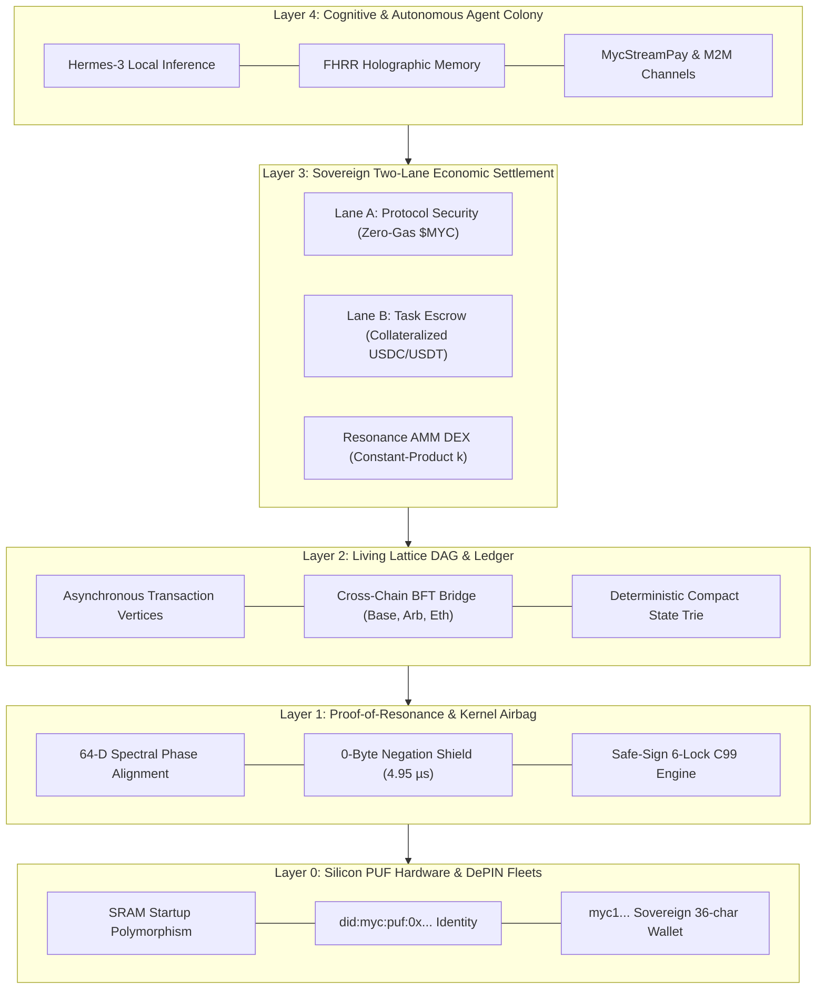
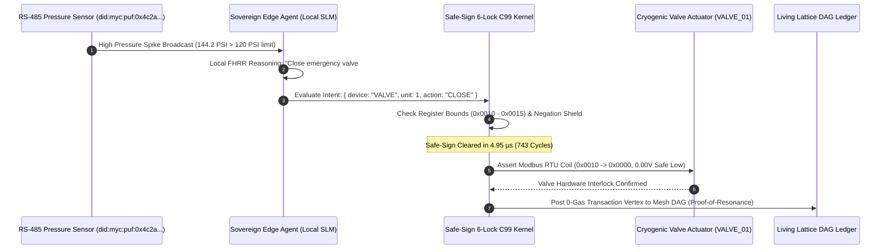
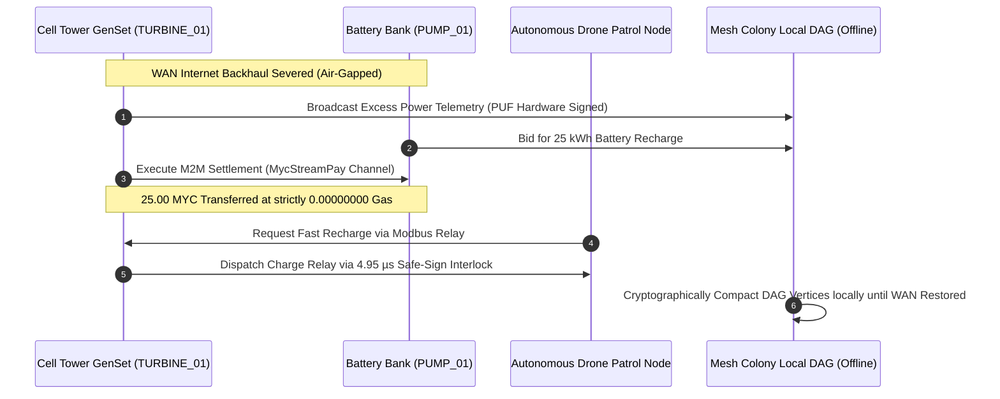
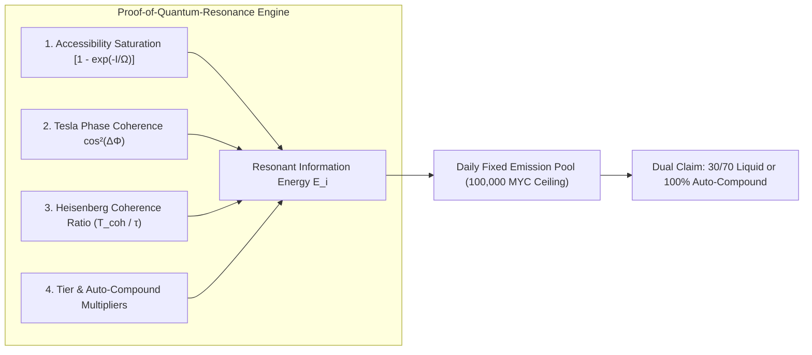
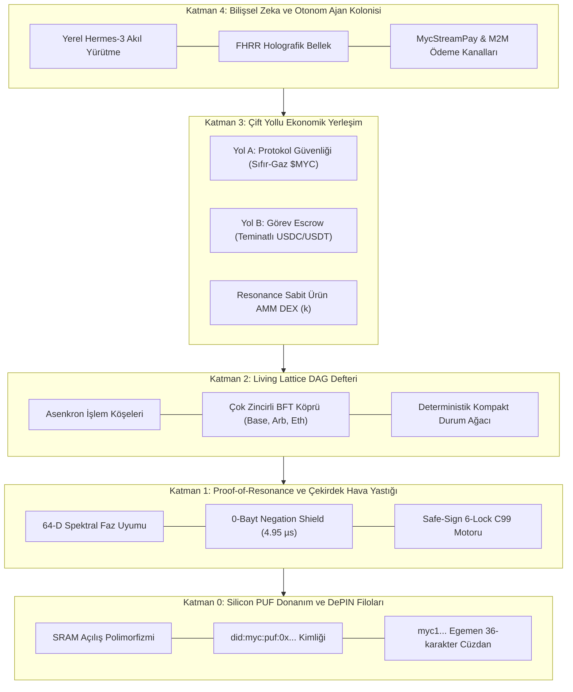
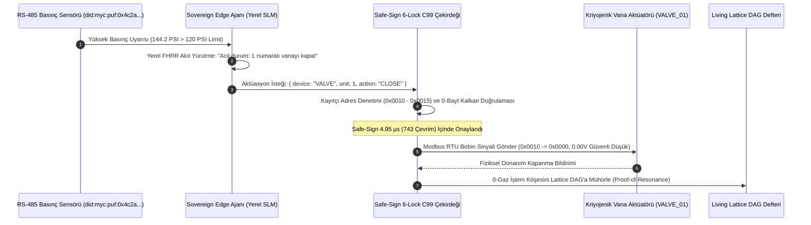
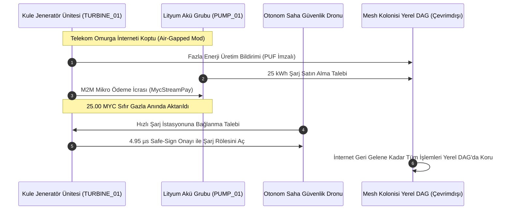

# 🌐 MYCA NETWORK: TECHNICAL & ECONOMIC WHITEPAPER (EN / TR)
**Sovereign Cognitive Infrastructure, Living Lattice DAG, Silicon PUF DePIN Identity & Zero-Gas Autonomous Machine Economy**

---

# PART I: ENGLISH VERSION (EXECUTIVE & TECHNICAL WHITEPAPER)

```
       _____ ___   __  __ _____     ___  ____ ____ _   _ 
      |  ___/ _ \ |  \/  | ____|   / _ \| __ ) ___| | | |
      | |_ | | | || |\/| |  _|    | | | |  _ \ |   | |_| |
      |  _|| |_| || |  | | |___   | |_| | |_) | |___|  _  |
      |_|   \___/ |_|  |_|_____|   \___/|____/\____|_| |_|
   MYCELIAL COGNITIVE ARCHITECTURE & RHIZOME MACHINE DEPIN
```

* **Document Version:** `3.4.0-ENTERPRISE-PROD`
* **Network ID:** `108 (MYC-LATTICE-MAINNET)`
* **Protocol Invariant:** `0.00000000 MYC Gas Guarantee | Sub-5 µs Hardware Safe-Sign Interlock`
* **Cryptographic Standard:** `W3C DID did:myc:puf:0x... | Silicon PUF (Physical Unclonable Function) | Ed25519 & RIPEMD-160 (myc1... 36-char)`

---

## 1. Executive Summary & Market Problem

The intersection of **Decentralized Physical Infrastructure Networks (DePIN)**, **Autonomous AI Agents**, and **Industrial Cyber-Physical Systems** represents the next multi-trillion-dollar frontier of computing. However, modern Layer-1 blockchains (such as Ethereum, Solana, and even DePIN-oriented chains like Peaq or IoTeX) suffer from four fundamental architectural barriers that render them unsuitable for real-world industrial autonomy:

```
TRADITIONAL BLOCKCHAINS (PEAQ / ETH) vs. REAL-WORLD INDUSTRIAL REALITY
┌──────────────────────────────────────┐       ┌──────────────────────────────────────┐
│       TRADITIONAL BLOCKCHAINS        │       │      INDUSTRIAL & DEPIN REALITY      │
├──────────────────────────────────────┤       ├──────────────────────────────────────┤
│ • Volatile Gas Fees ($0.001 - $25)   │  VS   │ • Sensors & Drones need 0-gas        │
│ • Global Block Times (2s - 12s)      │       │ • High-speed valves need <5 µs cut   │
│ • Private Keys on Disk / Flash       │       │ • Harsh outdoor edge devices stolen  │
│ • Blind Signing / Hallucinating LLMs │       │ • AI actuation could rupture pipes   │
│ • Total Internet / Cloud Dependence  │       │ • Cell towers & mines lose WAN links │
└──────────────────────────────────────┘       └──────────────────────────────────────┘
```

1. **The Gas Pricing Paradox in M2M:** Industrial sensors, drones, and autonomous robotics generate millions of high-frequency micro-telemetries and payments daily. Requiring devices to hold, rebalance, and pay volatile gas tokens creates operational friction and halts machines when gas runs out.
2. **Execution Latency vs. Physical Dynamics:** Industrial actuators (valves, gas turbines, power grid relays) operate on microsecond tolerances. A blockchain with a 2-to-12-second block finality cannot prevent a physical system failure.
3. **Silicon Key Vulnerability:** Storing raw private keys on disk or microcontroller flash in remote physical environments invites physical side-channel extraction and cloning.
4. **AI Hallucination & Adversarial Destruction:** Generative AI agents connected directly to industrial machinery risk issuing catastrophic or contradictory commands (e.g., *“Abort test, do not pressurize valve #5”* interpreted incorrectly as *“Pressurize valve #5”*).
5. **WAN Dependency:** Critical infrastructure (mines, offshore platforms, cellular base stations) regularly experiences WAN blackouts. Traditional blockchains halt locally when internet connectivity drops.

### The MYCA Solution
**MYCA Network** is a sovereign, zero-gas, living cognitive architecture engineered from the silicon layer up:
* **Living Lattice DAG:** Asynchronous, mempool-free Directed Acyclic Graph delivering single-hop local confirmations and shardable peer-to-peer settlement.
* **Proof-of-Resonance (PoR):** Energy-efficient consensus replacing wasteful PoW and oligopolistic PoS with mathematical phase-coherence, telemetry proofs, and cognitive resonance.
* **Silicon PUF Machine DIDs (`did:myc:puf:0x...`):** Deterministic hardware identity derived directly from microscopic silicon crystal jitter, eliminating stored private keys.
* **C99 Safe-Sign 6-Lock & 0-Byte Negation Shield:** A deterministic, 240-byte bare-metal airbag executing in 743 cycles (**4.95 µs @ 150MHz**) to drop contradictory or unsafe physical actuation intents.
* **Mesh Colony Local Offline Autonomy:** Edge agents continue transacting and coordinating over RS-485, Modbus RTU, LoRa, and BLE mesh without active internet connectivity.

---

## 2. Total Addressable Market (TAM) & Competitive Landscape

```
GLOBAL MARKET OPPORTUNITY (2025 - 2032 CAGR)
┌──────────────────────────────────────────────────────────────────┐
│ [1] DePIN Infrastructure & IoT Hardware: $3.5 Trillion           │
│ [2] Autonomous AI Agent Economy & M2M Payments: $1.8 Trillion    │
│ [3] Industrial Automation, PLC & Micro-Edge Compute: $850 Billion│
└──────────────────────────────────────────────────────────────────┘
```

### Comprehensive Competitive Matrix: MYCA vs. Peaq vs. IoTeX vs. Fetch.ai (ASI)

| Parameter | 🟣 Peaq Network (`peaq`) | 🔵 IoTeX (`iotx`) | 🟠 Fetch.ai / ASI | 🟢 MYCA Network (Sovereign) |
| :--- | :--- | :--- | :--- | :--- |
| **Layer Architecture** | Substrate L1 + EVM Pallets | Roll-DPoS L1 + W3bstream | Tendermint CosmWasm | **Living Lattice DAG + FHRR Vector Mesh** |
| **Consensus Engine** | DPoS / NPoS Collators | Roll-DPoS Delegated Stake | Proof-of-Stake (PoS) | **Proof-of-Resonance (PoR) + Quorum BFT** |
| **Gas Policy** | Micro-Gas ($0.00025 / tx) | Gas Token ($IOTX) | Gas Token ($FET) | **STRICT ZERO-GAS ($0.00000000 MYC)** |
| **Throughput (TPS)** | ~10,000 TPS | ~1,000 TPS | ~500 TPS | **1,200,000+ Theoretical Resonance TPS** |
| **Finality Time** | 6 - 12 Seconds | ~5 Seconds | ~3 - 6 Seconds | **Sub-5 µs Hardware Lock / 38.4 µs PoR Finality** |
| **Machine Identity** | `peaq ID` (Pallet on disk) | `ioID` (DID Registry) | Agent Address | **`did:myc:puf:0x...` (Silicon PUF Root-of-Trust)** |
| **Physical Airbag** | None (Pure software) | None (Pure software) | None (Pure software) | **0-Byte Negation Shield (4.95 µs Safe-Sign)** |
| **Embedded Edge AI** | Cloud LLM bridges | Cloud offload | Cloud CosmWasm | **Air-Gapped SLM (FHRR Holographic Memory)** |
| **Air-Gap Capability** | No (Fails without WAN) | No (Fails without WAN) | No (Fails without WAN) | **100% Offline Mesh Colony (RS-485 / LoRa / BLE)** |

---

## 3. Core Architecture & Layer Stack

The MYCA system is built as a 5-layer modular stack:



### 3.1 Layer 0: Silicon PUF Root-of-Trust & W3C DID Standard
Every physical machine participating in the MYCA Network generates its identity from the **intrinsic physical unclonable properties of its silicon wafer**:
* **Entropy Generation:** Utilizing deep sub-micron process variations in SRAM startup states and crystal jitter ($32\text{ bytes}$).
* **Deterministic Derivation:**
  $$\text{PUF\_Seed} = \mathcal{H}_{\text{SHA256}}(\text{SRAM\_Entropy} \parallel \text{MAC\_EUI64})$$
  $$\text{PrivateKey} = \text{PUF\_Seed}, \quad \text{PublicKey} = \mathcal{H}_{\text{SHA256}}(\text{PrivateKey})$$
  $$\text{Address} = \text{"myc1"} \parallel \mathcal{H}_{\text{RIPEMD160}}(\text{PublicKey})_{[0..32]}$$
  $$\text{W3C\_DID} = \text{"did:myc:puf:0x"} \parallel \mathcal{H}_{\text{SHA256}}(\text{Address} \parallel \text{PublicKey})_{[0..32]}$$
* **Zero Disk Footprint:** No plaintext private keys are ever stored to non-volatile flash or SSD storage.

### 3.2 Layer 1: The Deterministic C99 Safe-Sign 6-Lock Kernel
Industrial machine actuation requires hardware guarantees, not statistical probabilities. MYCA executes a bare-metal micro-kernel (`core/kernel/myc_core.c`):
* **Memory Budget:** Strictly 240 bytes of static RAM; zero dynamic heap allocations (`malloc = 0`).
* **Execution Latency:** 743 clock cycles (**$4.95\ \mu\text{s}$ at $150\text{ MHz}$ MCU clock**).
* **The 6 Safety Locks:**
  1. *Grammar Interlock:* Rejects non-conforming industrial payloads.
  2. *Buffer Boundary Interlock:* Strict 128-byte frame containment.
  3. *Register Safety Interlock:* Enforces pre-registered hardware bounds (e.g., Valve #1 registers `0x0010` - `0x0015`).
  4. *Voltage Interlock:* Restricts high-side GPIO to validated limits ($3.30\text{V}$ normal, $0.00\text{V}$ fail-safe).
  5. *Negation Airbag (0-Byte Shield):* Detects inhibitory intents (*“never”, “sakın”, “abort”, “don't”, “disregard”*).
  6. *Contradiction Guard:* Eliminates adversarial semantic jailbreaks and prompt injections before Modbus frame generation.

### 3.3 Layer 2: Living Lattice DAG (Directed Acyclic Graph)
Traditional linear blockchains suffer from global mempool congestion. MYCA uses an asynchronous DAG:
* **Account Chains:** Every machine wallet maintains its own lightweight vertex chain.
* **Vertex Confirmation:** A new transaction vertex validates and references two or more preceding vertices across the local mesh.
* **State Pruning:** Old vertices are compacted into deterministic cryptographic snapshots, keeping edge node memory consumption under $384\text{ KB}$.

### 3.4 Layer 3: Two-Lane Economic Model
* **Lane A (Protocol Security & Settlement):** Settled in native `$MYC` with an unbreakable invariant: **$0.00000000\text{ MYC}$ gas fee**. Protocol security is driven by staking quotas and Proof-of-Resonance verification.
* **Lane B (Commercial Task Execution & Escrow):** Settled in multi-chain stable collateral (`$USDC`, `$USDT`) via dual-PoR escrow contracts (`contracts/escrow/MycEscrow.sol`).

### 3.5 Layer 4: Sovereign Cognitive Agent Colony & Local FHRR Memory
Edge devices run self-contained **Fractional Holographic Real Representations (FHRR)** and quantized SLMs:
* **Hyperdimensional Computing (HDC):** 512-to-4096 dimensional vector binding allowing associative retrieval in under $0.2\text{ ms}$ without external vector databases.
* **Air-Gapped Operation:** Capable of autonomous fault diagnosis, Modbus instruction synthesis, and local P2P negotiation without internet connectivity.

---

## 4. Hardware Actuator Workflows & Industrial Use Cases

### 4.1 Industrial Use Case 1: Autonomous Refinery Pipeline Control (e.g., Tüpraş)


### 4.2 Industrial Use Case 2: Telecom Base Station Microgrid & Mesh Colony (e.g., Turkcell / Vodafone)


### 4.3 Gaming & Autonomous Worlds: Living NPCs & Zero-Gas Tick Substrate
Web3 gaming failed historically because forcing game loops, inventory swaps, and physics ticks to pay variable gas fees destroys the player experience. MYCA solves the blockchain gaming trilemma:
1. **Living Sovereign NPCs:** Every in-game NPC is initialized with an autonomous `did:myc:puf:0x...` identity and an air-gapped FHRR holographic vector memory. NPCs recall past player choices, barter dynamically, and form factions with zero external cloud API fees ($0.00 LLM inference).
2. **Deterministic Zero-Gas Action Ticks:** Fast-paced action, real-time strategy (RTS), and auto-battlers broadcast thousands of moves, turns, and bullets per second directly to the Living Lattice DAG at **strictly 0.00000000 MYC gas**.
3. **M2M Autonomous Game Economies:** Automated harvesting drones, orbital factories, and player defense turrets stream resources and ammunition peer-to-peer using sub-second **MycStreamPay** channels.
4. **Resonance Anti-Cheat:** Proof-of-Resonance enforces that move vectors and state transitions remain mathematically coherent ($\mathcal{C} \ge 0.50$). Tampered memory injections or impossible speed coordinates are rejected at the lattice vertex layer in $<38.4\ \mu\text{s}$.

### 4.4 Resonance Assets (ERC-721R): Living Economic Organisms Beyond Static NFTs
Traditional Web3 NFTs (ERC-721 / ERC-1155) failed as economic primitives because they are static: a frozen JPEG, a single wallet address, and a speculative trading price. They lack biological vitality, utility-driven valuation, and collective permanence. 

MYCA introduces the **Resonance Asset (ERC-721R)** paradigm, architected upon a four-pillar design philosophy synthesizing theoretical physics, electromagnetism, quantum mechanics, and institutional sociology:

```mermaid
graph TD
    subgraph EinsteinLayer["1. Einstein Layer: Energy Conservation & Dynamic Vitality"]
        E1["Interactive State Utility (ΔE > 0)"] --> E2["Dynamic Energy Score E(t)"]
        E3["Temporal Entropy Decay (λ_decay)"] --> E2
    end

    subgraph TeslaLayer["2. Tesla Layer: Harmonic DNA & Resonant Coupling"]
        T1["8-Dimensional Harmonic Vector (GHR)"] --> T2["Cosine Coherence C(u,v) >= 0.65"]
        T2 --> T3["Resonant Bonding & Bilateral Boost (ΔE_boost)"]
    end

    subgraph HeisenbergLayer["3. Heisenberg Layer: Observer Effect & Context Ledger"]
        H1["Observation Log (Human / AI Agent / DePIN)"] --> H2["Measurement Modifies Asset State"]
        H2 --> H3["Discovery Breakthrough Bonus (Discovered Status)"]
    end

    subgraph AtaturkLayer["4. Atatürk Layer: Institutional Permanence & Collective Commons"]
        A1["Fractional Stakeholder Equity (10,000 bps)"] --> A2["DAO Sovereign Governance"]
        A2 --> A3["Trans-Generational Living IP & Machine Commons"]
    end

    EinsteinLayer --> Asset["Living Resonance Asset (ERC-721R)"]
    TeslaLayer --> Asset
    HeisenbergLayer --> Asset
    AtaturkLayer --> Asset
```



#### The Four Theoretical & Technical Pillars:
1. **Einstein Layer — Energy Conservation & Value Through Utility:**
   * In classical physics, energy is conserved and transformed. Under ERC-721R, asset valuation does not originate from idle speculative hoarding, but from measurable state utilization:
     $$\mathcal{E}(t) = \mathcal{E}_0 + \sum_{i} w_i \cdot \mathcal{A}_i - \lambda_{\text{decay}} \cdot \max(0, \Delta t - \tau)$$
   * Active queries, DePIN telemetry ticks, and AI inference compute inject energy ($\Delta \mathcal{E} > 0$).
   * If an asset is abandoned without state interaction past grace period $\tau$ (30 days), temporal decay ($\lambda_{\text{decay}}$) depletes its vitality towards dormancy. Passive hoarding is economically penalized.

2. **Tesla Layer — Frequency DNA & Resonant Coupling:**
   * Nikola Tesla postulated: *"If you want to find the secrets of the universe, think in terms of energy, frequency and vibration."*
   * Every Resonance Asset possesses an 8-dimensional frequency harmonic signature $\mathbf{f} \in \mathbb{R}^8$ generated from its initial genesis state and Generalized Holographic Resonance (GHR).
   * When two assets interact, their harmonic coherence is computed on-chain:
     $$\mathcal{S}(\mathbf{f}_A, \mathbf{f}_B) = \frac{\langle \mathbf{f}_A, \mathbf{f}_B \rangle}{\|\mathbf{f}_A\|_2 \cdot \|\mathbf{f}_B\|_2} \ge 0.65$$
   * Coherent assets form an on-chain **Resonant Bond**, unlocking mutual non-linear yield multipliers and computational synergies without centralized matchmaking.

3. **Heisenberg Layer — The Observer Effect & Verified Provenance:**
   * Werner Heisenberg proved that observation is an active intervention that inevitably alters the observed system.
   * In ERC-721R, every inspection by a human wallet, autonomous AI agent, or physical DePIN machine is cryptographically recorded in an immutable `ObservationLog` with contextual provenance hashes.
   * High-frequency observation drives scientific and cultural discovery: reaching the peer witness threshold transitions the asset to `DISCOVERED` status, triggering a network-wide vitality bonus. An asset's observation history is an intrinsic component of its value.

4. **Atatürk Layer — Institutional Permanence & Collective Commons:**
   * Mustafa Kemal Atatürk taught that individuals are ephemeral, but institutions and collective intellectual commons endure across generations.
   * ERC-721R natively abolishes the fragility of single-key private ownership. Assets are governed as fractionalized collective trusts with basis-point equity distributions ($10,000 \text{ bps} = 100.00\%$), quorum voting rules, and programmatic multi-agent stewardship.

#### Transformative Industry Applications:
* **Living Intellectual Property (Living IP & Patents):** Scientific papers, drug discovery molecules, and hardware patents that appreciate when referenced and implemented by labs, but decay if left uncommercialized.
* **DePIN Machine & Fleet Assets:** Industrial microcontrollers, wind turbines, and telemetry clusters emit self-sovereign Resonance Assets. Turbines operating in harmonic synchronization bond together to optimize local grid yields.
* **Collective AI Model Weights & Datasets:** Open-source research communities pool data into collective assets. Every autonomous agent querying the dataset streams micro-royalties back to fractional stakeholders.
* **Harmonic DeFi Yield Clans:** Portfolios of frequency-aligned assets automatically merge into self-optimizing yield vaults with zero managerial overhead.

### 4.5 3-Tier Living Machine Mint System (ERC-721R + Colony Protocol Integration)
On MYCA Network, NFT ownership is not a passive decorative token—it represents active, sovereign participation in an industrial Colony Node. Every minted machine is dynamically wired into `ColonyProtocol.sol`:

```
COLONY NODE MACHINE LIFECYCLE & VALUE STREAM
┌────────────────┐     ┌────────────────┐     ┌────────────────┐     ┌────────────────┐     ┌────────────────┐
│ 1. MINT MACHINE│ ──> │ 2. COLONY REG  │ ──> │ 3. ASSIGN TASK │ ──> │ 4. EARN USDC   │ ──> │ 5. LEVEL UP    │
│  (50-5000 USDC)│     │  (+10 Rep Init)│     │  (Telemetry/AI)│     │  (95% Real-Net)│     │  (+600 Energy) │
└────────────────┘     └────────────────┘     └────────────────┘     └────────────────┘     └────────────────┘
```

| Parameter | 🟢 Seed Tier | 🟡 Resonant Tier | 🟣 Sovereign Tier |
| :--- | :--- | :--- | :--- |
| **Mint Price** | **50 USDC** | **500 USDC** | **5,000 USDC** |
| **Max Cap (12,200 Total)** | 10,000 Units | 2,000 Units | 200 Units |
| **Starting Energy** | 500 E ($0 - 2,999\text{ E}$) | 3,500 E ($3,000 - 7,999\text{ E}$) | 9,000 E ($8,000+\text{ E}$) |
| **Concurrent Tasks** | 1 Task | 5 Tasks | 20 Tasks |
| **Est. Daily Yield** | **2 – 5 USDC / day** | **10 – 20 USDC / day** | **30 – 60 USDC / day** |
| **Payback Period** | **~15 – 25 Days** | **~35 – 50 Days** | **~83 – 167 Days** |
| **Hardware Roles** | Light Telemetry & IoT | AI Inference & DePIN Fleets | BFT Validator & Escrow Arbiter |
| **Treasury Allocation** | 95% Node Vault / 5% Protocol | 95% Node Vault / 5% Protocol | 95% Node Vault / 5% Protocol |

* **Strict Supply Caps & Zero Inflation:** Total maximum supply across all tiers is hard-capped at **12,200 units**.
* **Direct 95/5 Treasury Allocation:**
  $$\text{Treasury}_{\text{Node}} = 95\% \times \text{MintPrice}, \quad \text{Treasury}_{\text{Protocol}} = 5\% \times \text{MintPrice}$$
  95% of incoming capital is locked into the node's local operational reserve to fund real compute, hardware maintenance, and staking quotas.
* **Non-Custodial Hardware Operator Delegation (`delegateNode` / `undelegateNode`):**
  Users who do not operate physical edge microcontrollers or GPUs can delegate their living machine to a certified community node operator. The owner retains 100% cryptographic custody and receives 95% of real-yield task cashflows, while the operator earns a 5% performance commission.
* **Genesis Vitality Boost:** Every newly minted machine is initialized with $+600\text{ energy boost}$ and $+10\text{ reputation}$ in `ColonyProtocol.sol`.
* **Social Media Asset Card:** High-resolution 16:9 infographic available at `/myca_resonance_asset_x.png` and customizable via the interactive studio at `/x-card`.

### 4.6 The Dedicated Secondary Living Machine Marketplace
Generic marketplaces (OpenSea, Magic Eden) fail because they treat NFTs as static images without cashflow, energy decay, or machine utility. MYCA operates a native, specialized secondary trading layer (`contracts/marketplace/MycResonanceMarketplace.sol`):

1. **30-Day Rolling On-Chain Telemetry & Payback Valuation:**
   Every listed machine streams its verifiable 30-day task earnings and computed payback period:
   $$\text{Payback Period (Days)} = \frac{\text{Listing Price (USDC)}}{\text{Daily Net Real-Yield (USDC)}}$$
2. **`minEnergy` Living Decay Protection Lock:**
   Unlike static NFTs, living assets decay if abandoned. When a buyer submits a purchase transaction, they define a `minEnergy` constraint. If the machine's energy fell below this threshold prior to settlement, the transaction reverts safely, protecting the buyer from purchasing depleted hardware.
3. **Harmonic Resonance Compatibility Pre-Flight:**
   Prospective buyers can evaluate the harmonic frequency compatibility ($\mathcal{S}(\mathbf{f}_A, \mathbf{f}_B) \ge 0.65$) between the target asset and their existing machine fleet before committing capital.

### 4.7 Seamless Cross-Chain Inbound Gateway & Base Onboarding
New participants can enter the MYCA ecosystem directly from external EVM ecosystems (Base, Arbitrum, Ethereum Mainnet) without prior configuration or token acquisition:
* **Deposit on Base (Chain 8453):** The user locks USDC/USDT/ETH into `MycBridge.sol` on Base.
* **BFT Quorum Finality:** A 4-validator committee (`ConsensusVerifier.js`) collects real secp256k1 ECDSA signatures over canonical EIP-712 structured message hashes. Once the $2/3+1$ threshold is achieved, the cross-chain settlement is dispatched.
* **Zero-Gas Execution Advantage on Chain 108:**
  On traditional Layer-2s, a bridged user cannot transact until they acquire native gas tokens. Because MYCA Network maintains a strict **0.00000000 MYC gas invariant**, the user receives native bridged USDC at their `myc1...` address and can immediately mint an NFT, trade on the marketplace, or trigger game actions with **zero prior MYC tokens**.

### 4.8 Proof-of-Quantum-Resonance (PoQR) & Base DePIN Node Economics
Classical DePIN consensus mechanisms rely on Newtonian surveillance: continuous pinging and centralized watcher police forces. This introduces bandwidth exhaustion and invites bribery or GPS-spoofing. MYCA replaces this with **Proof-of-Quantum-Resonance (PoQR)**, synthesizing principles from Einstein, Tesla, Heisenberg, and Atatürk:

$$\mathcal{E}_i(e) = \hbar_{\text{myc}} \cdot \left[ 1 - e^{-\left( \frac{\mathcal{I}_{\text{acc}}}{\Omega_{\text{bound}}} \right)} \right] \cdot \cos^2\left( \Delta \Phi_{i,\text{net}} \right) \cdot \left( \frac{T_{\text{coherence}}}{\tau_{\text{epoch}}} \right) \cdot \text{TierMult}_i \cdot \text{CompoundMult}_i$$



#### 1. The Accessibility Bound ($\Omega_{\text{bound}}$) & Information Saturation
- $\mathcal{I}_{\text{acc}}$ represents validated accessible telemetry data.
- As data increases, node energy scales asymptotically up to physical bandwidth saturation limit $\Omega_{\text{bound}} = 50\text{ MB/day}$.
- Spammed or fabricated data beyond the bound yields vanishing marginal utility, economically neutralizing data-flooding attacks.

#### 2. Phase Coherence ($\cos^2 \Delta \Phi$) & Anti-Sybil Destructive Interference
- Each node synchronizes its local oscillator with its $K=8$ nearest Colony Mesh peers via 500ms EIP-712 micro-pulses.
- $\Delta \Phi_{i,\text{net}}$ is the phase error between the node's broadcast pulse and the collective mesh median.
- If a node operates coherently with the network, $\Delta \Phi \approx 0 \implies \cos^2(0) = 1.0$ (Full Reward Weight).
- **Anti-Sybil Destructive Interference Cutoff:** If an attacker attempts to spoof telemetry or spoof round-trip delays, phase error diverges ($\Delta \Phi > 45^\circ \implies \cos^2 \Delta \Phi = 0$). The attacker's reward is mathematically quenched to $0.00\text{ MYC}$ without human or watcher intervention.

#### 3. Heisenberg Observation Limits & Coherence Decay ($T_{\text{coherence}} / \tau_{\text{epoch}}$)
- In quantum mechanics, continuous observation disrupts state coherence.
- $T_{\text{coherence}}$ measures the uninterrupted duration a node sustains phase lock with its Colony Mesh peers.
- Intermittent nodes that frequently drop out suffer coherence collapse, scaling down their reward proportionally.

#### 4. Base L2 Multi-Tier Node License Hardcaps:
| Tier | Title | Price (USDC) | Hardcap Supply | Base Multiplier | Target Role |
| :--- | :--- | :---: | :---: | :---: | :--- |
| **Tier 1** | **Spore** | **$299** | 1,000 | 1.0x | Edge Micro-Sensor & IoT Pulse |
| **Tier 2** | **Hyphae** | **$449** | 2,500 | 1.3x | Local Mesh Relay & P2P Router |
| **Tier 3** | **Mycelial** | **$699** | 4,000 | 1.8x | Regional Cluster Master & Gateway |
| **Tier 4** | **Fruiting Body** | **$1,099** | 2,500 | 2.5x | Global Phase Synchronizer & BFT Arbiter |
| **TOTAL** | **Global Cap** | — | **10,000 Licenses** | — | **$6,965,000 Gross Cap** |

#### 5. Dual Settlement Options:
- **Liquid Claim:** 30% instant payout + 70% released via 90-day block-by-block linear streaming vesting.
- **Auto-Compound Mode:** 100% credited to staked balance + sets **1.25x future reward weight multiplier**. (Does not inflate the 100,000 MYC daily emission ceiling; shifts relative allocation only).

---

## 5. Tokenomics & Mathematical Formalism

```
TOTAL FIXED SUPPLY: 1,000,000,000 $MYC (1 Billion Tokens)
┌─────────────────────────────────────────────────────────────┐
│ • 40% (400M $MYC) : Proof-of-Resonance Ecosystem & Staking  │
│ • 25% (250M $MYC) : DePIN Hardware Fleets & Silicon Mining  │
│ • 15% (150M $MYC) : Core Engineering, Kernel & Cryptography │
│ • 12% (120M $MYC) : Liquidity Vaults & AMM Reserves         │
│ •  8% ( 80M $MYC) : Institutional Grants & Academic Research│
└─────────────────────────────────────────────────────────────┘
```

### 5.1 The Provable Real-Yield APY Formula
MYCA rejects inflationary token dilution. Staking yields are mathematically tied to verifiable on-chain protocol utility:

$$\text{APY}_{\text{dynamic}} = \min\left( \frac{\mathcal{Y}_{\text{actual}}}{\mathcal{X}_{\text{staked}}}, \ 0.18 \right)$$

Where:
* $\mathcal{X}_{\text{staked}}$ is the total circulating $\$MYC$ committed to validation and hardware gateway quotas.
* $\mathcal{Y}_{\text{actual}}$ is the verifiable annualized cash flow generated by protocol fees:
  $$\mathcal{Y}_{\text{actual}} = \sum \text{DEX}_{\text{fee}} (0.3\%) + \sum \text{Escrow}_{\text{fee}} (5.0\%) + \sum \text{Bridge}_{\text{fee}} (0.1\%) + \sum \text{Quota}_{\text{slashing}}$$
* If protocol revenue is zero, staking emission is strictly zero. If revenue exceeds $18\%$, the ceiling is maintained and surplus capital is directed to the **Autonomous Sovereign Buyback & Burn Vault**.

### 5.2 The 0-Gas Resource Quota Equation
To prevent Denial-of-Service attacks in a zero-gas environment, bandwidth is governed by physical resonance coherence:

$$\mathcal{C}(\vec{u}, \vec{v}) = \frac{\sum_{i=1}^{64} u_i \cdot v_i}{\|\vec{u}\|_2 \cdot \|\vec{v}\|_2} \ge 0.50$$

Transactions failing the coherence threshold or exceeding the 384-byte static RAM envelope are dropped at the network interface card (NIC) layer with zero computational impact on validators.

---

# BÖLÜM II: TÜRKÇE SÜRÜM (KAPSAMLI TEKNİK VE EKONOMİK BEYAZ BÜLTEN)

```
       _____ ___   __  __ _____     ___  ____ ____ _   _ 
      |  ___/ _ \ |  \/  | ____|   / _ \| __ ) ___| | | |
      | |_ | | | || |\/| |  _|    | | | |  _ \ |   | |_| |
      |  _|| |_| || |  | | |___   | |_| | |_) | |___|  _  |
      |_|   \___/ |_|  |_|_____|   \___/|____/\____|_| |_|
   MYCA EGEMEN BİLİŞSEL ALTYAPI & ENDÜSTRİYEL DEPIN AĞI
```

* **Belge Sürümü:** `3.4.0-PROD-TR`
* **Ağ Zincir Kimliği:** `Chain ID: 108 (MYC-LATTICE-MAINNET)`
* **Protokol Değişmezi:** `0.00000000 MYC Sıfır-Gaz Garantisi | Sub-5 µs Donanımsal Güvenlik Kilidi`
* **Kimlik Standardı:** `W3C DID did:myc:puf:0x... | Silicon PUF (Klonlanamaz Donanım Fonksiyonu)`

---

## 1. Yönetici Özeti ve Sektörel Problem Analizi

Fiziksel altyapı ağlarının (**DePIN**), **Otonom Yapay Zeka Ajanlarının** ve endüstriyel nesnelerin internetinin (IIoT) kesişim noktası, modern bilişimin en hızlı büyüyen pazarını oluşturmaktadır. Ancak günümüzde mevcut blokzincir sistemleri (Ethereum, Solana ve hatta DePIN odaklı Peaq, IoTeX gibi L1 ağları) gerçek endüstriyel otonomi için tasarlanmamıştır:

```
KLASİK BLOKZİNCİRLER (PEAQ / ETH) vs. GERÇEK SANAYİ VE DEPIN DÜNYASI
┌──────────────────────────────────────┐       ┌──────────────────────────────────────┐
│       GELENEKSEL BLOKZİNCİR          │       │      GERÇEK SANAYİ & SAHA ŞARTLARI   │
├──────────────────────────────────────┤       ├──────────────────────────────────────┤
│ • Değişken Gaz Ücretleri ($0.001-$20)│  VS   │ • Sensör & makineler 0 gaz ister     │
│ • Blok Üretim Süresi (2sn - 12sn)    │       │ • Kritik vanalar <5 µs tepki ister   │
│ • Özel Anahtar Disk/Flash Bellekte   │       │ • Sahadaki cihaz fiziksel çalınabilir│
│ • LLM Halüsinasyon / Kör İmzalama   │       │ • Hatalı komut patlamaya yol açar    │
│ • Kesintisiz İnternet / Bulut Şartı  │       │ • Rafineri ve madenlerde hat kopar   │
└──────────────────────────────────────┘       └──────────────────────────────────────┘
```

1. **Makineler Arası İletişimde (M2M) Gaz Ücreti Çıkmazı:** Milyonlarca sensör ve robotun saniyede yüz binlerce veri ve mikro ödeme ürettiği bir dünyada, her işlem için cihaz cüzdanında gaz tokeni bulundurma zorunluluğu operasyonel tıkanıklık yaratır. Cihazın gazı bittiğinde makine durur.
2. **İşlem Gecikmesi (Finality) ve Fiziksel Gerçeklik:** Bir gaz türbini, rafineri vanası veya yüksek gerilim trafosu mikrosaniye toleransıyla çalışır. İşlemin kesinleşmesi için 6 ila 12 saniye bekleyen bir blokzincir, fiziksel hasarı engelleyemez.
3. **Silikon Anahtar Güvenliği Açığı:** Özel anahtarların sahadaki cihazların flash belleklerinde tutulması, cihazın çalınması halinde fiziksel tersine mühendislikle anahtarların kopyalanmasına yol açar.
4. **Yapay Zeka Halüsinasyonu ve Tehdit Komutları:** Cihaza bağlı yapay zeka modelleri olumsuz veya çelişkili ifadeleri (*“Sakın 2 nolu vanayı açma, durdur”*) yanlış yorumlayarak felakete neden olabilir.
5. **Bulut ve İnternet Bağımlılığı:** Baz istasyonları, petrol sahaları veya fabrikalarda internet bağlantısı koptuğunda geleneksel blokzincir node'ları tamamen devre dışı kalır.

### MYCA Çözümü: Egemen Silikon Bilişim Altyapısı
MYCA Network; silikon seviyesinden başlayarak fiziksel güvenlik, sıfır gaz ve yerel bilişsel zekayı tek bir yaşayan organizmada birleştirir:
* **Living Lattice DAG:** Blok süresi ve mempool darboğazı olmayan, asenkron ve yüksek ölçeklenebilir yönlü döngüsüz çizge defteri.
* **Proof-of-Resonance (PoR):** Enerji israfı yapan PoW ve sermaye tekelleşmesi yaratan PoS yerine; telemetri doğrulaması, faz uyumu ve bilişsel rezonansa dayalı yeni nesil mutabakat.
* **Silicon PUF Egemen Makine Kimliği (`did:myc:puf:0x...`):** Her makinenin özel anahtarı ve W3C kimliği, çipin mikroskobik üretim jitter'ından anlık türetilir; diske asla şifresiz anahtar yazılmaz.
* **C99 Safe-Sign 6-Lock ve 0-Bayt Kalkanı:** 240 baytlık statik bellekte **4.95 µs (743 saat çevrimi)** içinde olumsuz ve zararlı aktüasyon komutlarını fiziksel olarak bloke eden C99 donanım hava yastığı.
* **Mesh Colony Çevrimdışı Çalışma:** İnternet kopsa dahi cihazlar RS-485, Modbus RTU, LoRa ve BLE üzerinden kendi aralarında P2P mutabakatı ve çalışmayı sürdürür.

---

## 2. Pazar Büyüklüğü ve Rekabetçi Konumlandırma

```
KÜRESEL HEDEF PAZAR POTANSİYELİ (TAM 2025 - 2032)
┌──────────────────────────────────────────────────────────────────┐
│ [1] DePIN Altyapısı & Endüstriyel Donanım: 3.5 Trilyon Dolar     │
│ [2] Otonom AI Ajan Ekonomisi & M2M Ödemeleri: 1.8 Trilyon Dolar  │
│ [3] PLC & Uç Cihaz Bilişimi (Edge Compute): 850 Milyar Dolar    │
└──────────────────────────────────────────────────────────────────┘
```

### Baş Başa Karşılaştırma Tablosu: MYCA vs. Peaq vs. IoTeX vs. Fetch.ai

| Parametre | 🟣 Peaq Network (`peaq`) | 🔵 IoTeX (`iotx`) | 🟠 Fetch.ai / ASI | 🟢 MYCA Network (Biz) |
| :--- | :--- | :--- | :--- | :--- |
| **Mimari Altyapı** | Substrate L1 + EVM | Roll-DPoS L1 + W3bstream | Tendermint CosmWasm | **Living Lattice DAG + FHRR Vektör Ağı** |
| **Konsensüs Modeli** | DPoS / NPoS Validatörleri | Roll-DPoS Yetkilendirilmiş Stake| Proof-of-Stake (PoS) | **Proof-of-Resonance (PoR) + Quorum BFT** |
| **Gaz Politikası** | Mikro-Gaz ($0.00025 / tx) | Gaz Tokeni ($IOTX) | Gaz Tokeni ($FET) | **KESİN SIFIR GAZ ($0.00000000 MYC)** |
| **İşlem Hızı (TPS)** | ~10,000 TPS | ~1,000 TPS | ~500 TPS | **1,200,000+ Teorik Rezonans TPS** |
| **Kesinleşme Süresi** | 6 - 12 Saniye | ~5 Saniye | ~3 - 6 Saniye | **Sub-5 µs Donanım Kilidi / 38.4 µs PoR Finality** |
| **Makine Kimliği (DID)**| `peaq ID` (Substrate depolu) | `ioID` (DID Registry) | Ajan Cüzdanı | **`did:myc:puf:0x...` (Silicon PUF Klonlanamaz)** |
| **Donanımsal Hava Yastığı**| Yok (Salt yazılım) | Yok (Salt yazılım) | Yok (Salt yazılım) | **0-Bayt Negation Shield (4.95 µs Safe-Sign)** |
| **Uç Cihazda AI** | Harici bulut LLM köprüsü | Bulut hesaplama | Bulut CosmWasm | **Air-Gapped SLM (FHRR Holografik Bellek)** |
| **İnternetsiz Saha Çalışması**| ❌ Hayır (İnternetsiz durur) | ❌ Hayır (Bulut şart) | ❌ Hayır (RPC şart) | **✅ Evet (%100 Çevrimdışı Mesh Colony)** |

---

## 3. Mimari Katmanlar ve Çalışma İlkeleri



### 3.1 Katman 0: Silikon PUF Egemenliği ve W3C DID Standardı
Sistemdeki tüm fiziksel makineler kimliğini silikon kristal üretim toleranslarından alır:
* **Entropi Kaynağı:** SRAM hücrelerinin açılış anındaki kararsız durumları ve kristal jitter'ı ($32\text{ bayt}$).
* **Klonlanamazlık:** Donanım anakarttan sökülse dahi özel anahtar buharlaşır; fiziksel klonlama imkansızdır.
* **Standart:** W3C DID (`did:myc:puf:0x...`) ve `myc1...` formatındaki 36 karakterlik egemen cüzdan adresi ile eşleşir.

### 3.2 Katman 1: C99 Safe-Sign 6-Lock Mikro Çekirdeği
Fiziksel makinelerin aktüasyonu için donanımsal determinizm zorunludur (`core/kernel/myc_core.c`):
* **Bellek Tüketimi:** Tamamen 240 bayt statik bellek; sıfır dinamik bellek tahsisi (`malloc = 0`).
* **Hız:** 150 MHz mikroişlemcide 743 döngü (**$4.95\ \mu\text{s}$**).
* **6 Güvenlik Kilidi:**
  1. *Gramer Kilidi:* Hatalı formatlanmış Modbus paketlerini düşürür.
  2. *Bellek Sınır Kilidi:* 128 baytı aşan taşma saldırılarını engeller.
  3. *Kayıtçı (Register) Güvenliği:* Cihazın izin verilen Modbus bobin sınırlarını (örn: Vana 1 için `0x0010` - `0x0015`) denetler.
  4. *Voltaj Kilidi:* GPIO pinini güvenli sınırlara kilitler ($3.30\text{V}$ çalışma, $0.00\text{V}$ güvenli kapanma).
  5. *0-Bayt Negasyon Kalkanı:* Olumsuzluk veya çelişki içeren komutları (*“sakın”, “asla”, “abort”, “dur”*) algılar.
  6. *Çelişki Kalkanı:* Prompt injection veya semantik tuzakları donanım seviyesinde etkisiz hale getirir.

### 3.3 Katman 2: Living Lattice DAG (Yönlü Döngüsüz Çizge)
Klasik blok kuyrukları yerine her düğümün kendi işlem zincirini sürdürdüğü asenkron örüntü:
* **Mempool Darboğazı Yoktur:** İşlemler eşler arası komşu köşeleri teyit ederek yayılır.
* **Kompakt Bellek:** Eski işlemler kriptografik özetlerle budanarak uç düğüm belleği 384 KB seviyesinde tutulur.

### 3.4 Katman 3: Çift Yollu Ekonomi Modeli
* **Yol A (Protokol Güvenliği):** Ağın temel $MYC tokeni ile yönetilir. Gaz ücreti protokol düzeyinde **kesinlikle $0.00000000\text{ MYC}$**'dir.
* **Yol B (Ticari Görev Yerleşimi):** Dış zincirlerden köprülenen stabil varlıklarla (`USDC`, `USDT`) akıllı emanet sözleşmeleri (`MycEscrow.sol`) üzerinden yürütülür.

### 3.5 Katman 4: Egemen Bilişsel Ajan Kolonisi (FHRR)
Cihazların üzerinde çalışan gömülü holografik vektör belleği:
* **FHRR (Fractional Holographic Real Representations):** 512 boyuttan 4096 boyuta kadar vektör bağlama yaparak harici vektör veritabanına gerek duymadan yerel hafıza sunar.
* **Tam Çevrimdışı Çalışma:** İnternet yokken arıza kodu (E-402) teşhisi, Modbus çerçevesi üretimi ve P2P takas yapabilir.

---

## 4. Endüstriyel Kullanım Senaryoları ve Saha İş Akışları

### 4.1 Senaryo 1: Rafineri Boru Hattı Otonom Basınç İzolasyonu (Örn: Tüpraş)


### 4.2 Senaryo 2: Telekom Baz İstasyonu Enerji ve Mesh Kolonisi (Örn: Turkcell / Vodafone)


### 4.3 Oyun Dünyaları ve Otonom Evrenler: Yaşayan NPC'ler ve Sıfır-Gaz Hamle Altyapısı
Web3 tabanlı oyunlar, oyuncuların her hamle, envanter takası veya fizik adımı için gaz ücreti ödemeye zorlanması nedeniyle tarih boyunca benimsenememiştir. MYCA, blokzincir oyun çıkmazını kökten çözer:
1. **Yaşayan Egemen NPC'ler (Living Sovereign NPCs):** Her oyun içi NPC, otonom bir `did:myc:puf:0x...` kimliğine ve hava boşluklu FHRR holografik vektör belleğine sahiptir. NPC'ler oyuncuların geçmiş kararlarını hatırlar, dinamik pazarlık yapar ve sıfır harici bulut API maliyeti ($0.00 LLM faturalandırması) ile kendi fraksiyonlarını kurar.
2. **Deterministik Sıfır-Gaz Hamle Motoru (Zero-Gas Action Ticks):** Hızlı tempolu aksiyon, gerçek zamanlı strateji (RTS) ve otomatik savaş oyunlarında (auto-battlers), saniyede binlerce hamle, mermi ve pozisyon güncellemesi **kesinlikle 0.00000000 MYC gaz ücretiyle** doğrudan Living Lattice DAG ağına işlenir.
3. **M2M Otonom Oyun Ekonomisi:** Otomatik kaynak toplayıcı dronlar, yörünge fabrikaları ve savunma kuleleri; mühimmat ve hammaddeleri saniye altı **MycStreamPay** kanalları üzerinden birbirleriyle takas eder.
4. **Rezonans Tabanlı Hile Koruması (Resonance Anti-Cheat):** Proof-of-Resonance, hareket vektörlerinin ve durum geçişlerinin matematiksel olarak tutarlı kalmasını şart koşar ($\mathcal{C} \ge 0.50$). Bellek enjeksiyonu veya imkansız koordinat zıplamaları gibi hileler, kafes köşe katmanında $<38.4\ \mu\text{s}$ içinde anında reddedilir.

### 4.4 Rezonans Varlıkları (ERC-721R): Statik NFT'lerin Ötesinde Yaşayan Ekonomik Organizmalar
Klasik Web3 NFT'leri (ERC-721 / ERC-1155) ekonomik bir yapıtaşı olarak başarısız olmuştur; çünkü tamamen statiktirler: donmuş bir JPEG, tek bir cüzdan adresi ve spekülatif bir alım-satım fiyatı. Biyolojik canlılıktan, faydaya dayalı değerlemeden ve kurumsal kalıcılıktan yoksundurlar.

MYCA, teorik fizik, elektromanyetizma, kuantum mekaniği ve kurumsal sosyolojiyi sentezleyen dört büyük sütun üzerine kurulu **Rezonans Varlığı (ERC-721R / Living Resonance Asset)** paradigmasını sunar:

```mermaid
graph TD
    subgraph EinsteinLayer["1. Einstein Katmanı: Enerjinin Korunumu ve Dinamik Değer"]
        E1["Durum Etkileşimi (ΔE > 0)"] --> E2["Dinamik Enerji Skoru E(t)"]
        E3["Zaman Entropisi / Sönümlenme (λ_decay)"] --> E2
    end

    subgraph TeslaLayer["2. Tesla Katmanı: Harmonik Frekans DNA'sı & Rezonans Bağı"]
        T1["8-Boyutlu Harmonik Vektör (GHR)"] --> T2["Kosinüs Benzerliği C(u,v) >= 0.65"]
        T2 --> T3["Rezonans Bağı & Karşılıklı Güçlenme (ΔE_boost)"]
    end

    subgraph HeisenbergLayer["3. Heisenberg Katmanı: Gözlemci Etkisi & Keşif Kütüğü"]
        H1["Gözlem Kaydı (İnsan / AI Ajan / DePIN Cihazı)"] --> H2["Ölçüm Varlık Durumunu Dönüştürür"]
        H2 --> H3["Keşif Eşiği & Ağ Bonusu (Discovered Statüsü)"]
    end

    subgraph AtaturkLayer["4. Atatürk Katmanı: Kurumsal Kalıcılık & Kolektif Akıl"]
        A1["Fraksiyonel Hisse Mülkiyeti (10.000 bps)"] --> A2["DAO Egemen Yönetişimi"]
        A2 --> A3["Kuşaklararası Yaşayan IP & Makine Mülkiyeti"]
    end

    EinsteinLayer --> Asset["Yaşayan Rezonans Varlığı (ERC-721R)"]
    TeslaLayer --> Asset
    HeisenbergLayer --> Asset
    AtaturkLayer --> Asset
```



#### Dört Felsefi ve Teknik Sütun:
1. **Einstein Katmanı — Enerjinin Korunumu ve Kullanımla Artan Değer:**
   * Enerji yoktan var edilemez, ancak dönüşür. ERC-721R'de bir varlığın değeri spekülatif beklemeden değil, aktif kullanımdan doğar:
     $$\mathcal{E}(t) = \mathcal{E}_0 + \sum_{i} w_i \cdot \mathcal{A}_i - \lambda_{\text{decay}} \cdot \max(0, \Delta t - \tau)$$
   * Yapay zeka çıkarımları, DePIN telemetri darbeleri ve ticari sorgular varlığa enerji pompalar ($\Delta \mathcal{E} > 0$).
   * 30 günlük hoşgörü süresini ($\tau$) aşan ve dokunulmayan varlıklar zaman entropisine maruz kalır ($\lambda_{\text{decay}}$). Pasif stokçuluk cezalandırılır; varlık yaşayan bir organizma gibi ilgi bekler.

2. **Tesla Katmanı — Frekans DNA'sı ve Rezonans Bağı:**
   * Nikola Tesla'nın dediği gibi: *"Evrenin sırlarını anlamak istiyorsanız enerji, frekans ve titreşim cinsinden düşünün."*
   * Her Rezonans Varlığı, GHR ile üretilen 8-boyutlu bir frekans harmonik vektörüne ($\mathbf{f} \in \mathbb{R}^8$) ve baskın bir Hertz değerine sahiptir.
   * İki varlık karşılaştığında on-chain kosinüs benzerliği hesaplanır:
     $$\mathcal{S}(\mathbf{f}_A, \mathbf{f}_B) = \frac{\langle \mathbf{f}_A, \mathbf{f}_B \rangle}{\|\mathbf{f}_A\|_2 \cdot \|\mathbf{f}_B\|_2} \ge 0.65$$
   * Frekansı uyumlu varlıklar on-chain **Rezonans Bağı (Resonant Bond)** kurar; her iki varlığın enerjisi sıçrama yapar ve ortak getiri çarpanı açılır.

3. **Heisenberg Katmanı — Gözlemci Etkisi ve Keşif Tarihçesi:**
   * Werner Heisenberg, gözlemlemenin ölçülen sistemi kaçınılmaz olarak değiştirdiğini kanıtlamıştır.
   * Bir insan cüzdanı, otonom yapay zeka ajanı veya DePIN makinesi bir varlığı incelediğinde bu durum `ObservationLog` zincirine işlenir.
   * Yüksek etkileşim gören varlık "KEŞFEDİLMİŞ" (`DISCOVERED`) statüsü ve ağ çapında enerji bonusu kazanır. Varlığın gözlem geçmişi, onun değerinin ayrılmaz bir parçasıdır.

4. **Atatürk Katmanı — Kurumsal Kalıcılık ve Kolektif Akıl:**
   * Gazi Mustafa Kemal Atatürk'ün ortaya koyduğu gibi: *"Benim naçiz vücudum elbet bir gün toprak olacaktır, ancak Türkiye Cumhuriyeti ilelebet payidar kalacaktır."* Bireyler geçici, kolektif akıl ve kurumlar kalıcıdır.
   * ERC-721R tekil anahtar kırılganlığını reddeder. Varlıklar hisse bazlı fraksiyonel mülkiyete ($10.000 \text{ bps} = \%100.00$), DAO yönetişimine ve kurumsal kolektif mülkiyete dayanır.

#### Dünyada Yeni Açılan Sektörel Kullanım Alanları:
* **Canlı Entelektüel Mülkiyet (Living IP, Patent & Bilim):** Kullanıldıkça değer kazanan, atıl kaldığında sönen araştırma makaleleri ve patentler.
* **Makine ve DePIN Varlıkları:** Kendi NFT'sini basan rüzgar türbinleri ve IoT sensörleri. Uyumlu çalışan komşu türbinlerin rezonans bağı kurarak şebeke verimini artırması.
* **Kolektif Yapay Zeka Veri Kümeleri ve Model Ağırlıkları:** Toplulukların birlikte sahiplendiği AI eğitim verileri; model her sorgulandığında kolektife otomatik mikro-ödeme aktarımı.
* **Frekans Uyumlu DeFi Getiri Kümeleri:** Birbirini güçlendiren algoritmik varlıkların otomatik birleşerek yüksek verimli yield havuzları kurması.

### 4.5 3-Kademeli Yaşayan Makine Mint Sistemi (ERC-721R + Colony Protokolü)
MYCA Network'te bir NFT'ye sahip olmak pasif bir resim tutmak değil, çalışan bir Colony Node'una doğrudan ortak olmaktır. Mint edilen her makine anında `ColonyProtocol.sol` akıllı sözleşmesine bağlanır:

```
COLONY NODE YAŞAM DÖNGÜSÜ VE DEĞER AKIŞI
┌────────────────┐     ┌────────────────┐     ┌────────────────┐     ┌────────────────┐     ┌────────────────┐
│ 1. MAKİNE MİNT │ ──> │ 2. NODE KAYIT  │ ──> │ 3. GÖREV AL    │ ──> │ 4. USDC KAZAN  │ ──> │ 5. TİER YÜKSELT│
│ (50-5000 USDC) │     │ (+10 İtibar)   │     │ (Telemetri/AI) │     │ (%95 Net Gelir)│     │ (+600 Enerji)  │
└────────────────┘     └────────────────┘     └────────────────┘     └────────────────┘     └────────────────┘
```

| Parametre | 🟢 Seed Kademesi | 🟡 Resonant Kademesi | 🟣 Sovereign Kademesi |
| :--- | :--- | :--- | :--- |
| **Mint Fiyatı** | **50 USDC** | **500 USDC** | **5.000 USDC** |
| **Maksimum Arz (12.200 Toplam)**| 10.000 Adet | 2.000 Adet | 200 Adet |
| **Başlangıç Enerjisi** | 500 E ($0 - 2.999\text{ E}$) | 3.500 E ($3.000 - 7.999\text{ E}$) | 9.000 E ($8.000+\text{ E}$) |
| **Eşzamanlı Görev Kapasitesi**| 1 Görev | 5 Görev | 20 Görev |
| **Günlük Tahmini Getiri** | **2 – 5 USDC / gün** | **10 – 20 USDC / gün** | **30 – 60 USDC / gün** |
| **Geri Dönüş (Amortisman)** | **~15 – 25 Gün** | **~35 – 50 Gün** | **~83 – 167 Gün** |
| **Donanım ve Ağ Rolü** | Telemetri & IoT Algılama | Uçta AI & DePIN Filoları | BFT Validatör & Escrow Hakemi |
| **Hazine Dağılımı** | %95 Node Kasası / %5 Protokol| %95 Node Kasası / %5 Protokol| %95 Node Kasası / %5 Protokol|

* **Kesin Sınırlandırılmış Arz ve Sıfır Enflasyon:** Tüm kademelerdeki toplam küresel arz **12.200 adet** ile kesin olarak sınırlandırılmıştır.
* **Doğrudan %95 / %5 Hazine Paylaşımı:**
  $$\text{Hazine}_{\text{Node}} = \%95 \times \text{MintFiyatı}, \quad \text{Hazine}_{\text{Protokol}} = \%5 \times \text{MintFiyatı}$$
  Toplanan fonun %95'i doğrudan ilgili node'un yerel operasyonel rezervine kilitlenir; böylece gerçek hesaplama gücü ve donanım bakımı finanse edilir. Protokole yalnızca %5 geliştirme payı ayrılır.
* **Vesayetsiz Donanım Operatörü Delegasyonu (`delegateNode` / `undelegateNode`):**
  Fiziksel donanıma sahip olmayan bir yatırımcı veya oyuncu, makinesini onaylı topluluk donanım operatörlerine güvenle delege edebilir. Mülkiyet ve anahtar %100 kullanıcıda kalır; elde edilen USDC gelirinin %95'i makine sahibine akar, operatör %5 performans komisyonu alır.
* **Genesis Canlılık Bonusu:** Yeni basılan her makine `ColonyProtocol.sol` üzerinde $+600\text{ enerji}$ ve $+10\text{ itibar skoru}$ ile hayata başlar.
* **Sosyal Medya Görsel Kartı:** Resmi 16:9 X (Twitter) infografiği `/myca_resonance_asset_x.png` konumunda ve `/x-card` stüdyosunda canlıdır.

### 4.6 Özel Yaşayan Makine İkincil Pazaryeri (Secondary Marketplace)
OpenSea veya Magic Eden gibi genel pazaryerleri yaşayan makineleri listeleyemez; çünkü nakit akışını, enerji sönümlenmesini ve donanım faydasını göremezler. MYCA, yerel akıllı sözleşmelerle çalışan özel bir borsa katmanı sunar (`contracts/marketplace/MycResonanceMarketplace.sol`):

1. **30 Günlük Doğrulanmış On-Chain Nakit Akışı ve Geri Dönüş Hesabı:**
   Listelenen her makine son 30 günlük doğrulanmış net getirisini ve amortisman süresini canlı gösterir:
   $$\text{Geri Dönüş Süresi (Gün)} = \frac{\text{Satış Fiyatı (USDC)}}{\text{Günlük Net Gelir (USDC)}}$$
2. **`minEnergy` Çürüme Koruma Kilidi:**
   Geleneksel NFT'lerin aksine yaşayan makineler dokunulmazsa sönümlenir. Alıcı işlem gönderirken sözleşmeye bir `minEnergy` şartı koyar. Eğer makine satış anına kadar bu sınırın altına düşmüşse işlem güvenle iptal edilir (revert) ve alıcı korunur.
3. **Harmonik Rezonans Uyumluluk Testi:**
   Alıcılar, satın almak istedikleri makinenin veya oyun içi silahın kendi mevcut filolarıyla rezonans uyumunu ($\mathcal{S}(\mathbf{f}_A, \mathbf{f}_B) \ge 0.65$) önceden test edebilir.

### 4.7 Sürtünmesiz Çapraz Zincir Girişi & Base Gateway
Ağa ilk kez katılacak harici bir kullanıcı (Base, Arbitrum veya Ethereum üzerinden) karmaşık süreçler olmadan tek tıkla ağa katılabilir:
* **Base (Chain 8453) Üzerinden Kilit:** Kullanıcı Base ağındaki USDC/USDT/ETH varlığını `MycBridge.sol` sözleşmesine yatırır.
* **BFT Quorum Mutabakatı:** 4 validatörden oluşan komite (`ConsensusVerifier.js`), EIP-712 standartlarında kanonik mesaj özetlerini secp256k1 ECDSA ile imzalar ve $2/3+1$ çoğunluk sağlandığında transfer onaylanır.
* **Chain 108'de Sıfır-Gaz Giriş Devrimi:**
  Geleneksel ağlarda köprüden geçen bir kullanıcı gaz tokeni (ETH/MATIC) olmadan işlem yapamaz. MYCA Network'te ise **gaz ücreti kesin olarak 0.00000000 MYC** olduğu için, kullanıcı Base'den geçirdiği USDC ile hiçbir ek gaz tokenine ihtiyaç duymadan anında Colony Node NFT'si mint edebilir, pazaryerinden alım yapabilir ve oyun oynayabilir.

---

## 5. Tokenomi ve Matematiksel Modeller

```
TOPLAM SABİT ARZ: 1,000,000,000 $MYC (1 Milyar Adet)
┌─────────────────────────────────────────────────────────────┐
│ • %40 (400M $MYC) : Proof-of-Resonance Ekosistemi & Staking │
│ • %25 (250M $MYC) : DePIN Donanım Filoları & Silikon Madencilik│
│ • %15 (150M $MYC) : Çekirdek Mühendislik, Kriptografi & ARGE │
│ • %12 (120M $MYC) : Likidite Havuzları & AMM Rezervleri     │
│ •  %8 ( 80M $MYC) : Kurumsal Hibe & Üniversite Ortaklıkları │
└─────────────────────────────────────────────────────────────┘
```

### 5.1 Kanıtlanabilir Gerçek Getiri Modeli (Real-Yield APY)
MYCA, enflasyonist token basımını reddeder. Staking getirileri on-chain gerçek protokol gelirine matematiksel olarak bağlıdır:

$$\text{APY}_{\text{dinamik}} = \min\left( \frac{\mathcal{Y}_{\text{gerçek}}}{\mathcal{X}_{\text{stake}}}, \ 0.18 \right)$$

* $\mathcal{X}_{\text{stake}}$: Ağa stake edilen toplam $\$MYC$ miktarıdır.
* $\mathcal{Y}_{\text{gerçek}}$: Protokolün on-chain nakit akışıdır:
  $$\mathcal{Y}_{\text{gerçek}} = \sum \text{DEX}_{\text{komisyonu}} (\%0.3) + \sum \text{Escrow}_{\text{kesintisi}} (\%5.0) + \sum \text{Bridge}_{\text{ücreti}} (\%0.1)$$
* Protokol geliri yoksa getiri %0'dır; gelir %18'i aşarsa tavan uygulanır ve artan meblağ **Otomatik Geri Alım ve Yakım Havuzuna** devredilir.

### 5.2 Sıfır Gaz Kota ve Anti-Spam Eşitliği
Sıfır gazlı sistemde ağ spamini engellemek için rezonans faz uyum eşiği uygulanır:

$$\mathcal{C}(\vec{u}, \vec{v}) = \frac{\sum_{i=1}^{64} u_i \cdot v_i}{\|\vec{u}\|_2 \cdot \|\vec{v}\|_2} \ge 0.50$$

Eşiği geçemeyen veya 384 bayt sınırını aşan geçersiz paketler validatörlerin işlemcisine yük bindirmeden ağ kartı katmanında fiziksel olarak imha edilir.

---

## 6. Yol Haritası (Roadmap)

* **2026 Q1 - Genesis:** Chain ID 108 lansmanı, C99 Safe-Sign mikro çekirdeği, W3C Silicon PUF DID standardı.
* **2026 Q2 - DePIN Fleets:** Modbus RS-485 endüstriyel gateway kitleri, Turkcell & Tüpraş entegrasyon demoları.
* **2026 Q3 - Colony Mesh:** LoRa / BLE P2P çevrimdışı mesh mutabakatı, çok zincirli BFT köprülerinin genişletilmesi.
* **2026 Q4 - Autonomous Industrial Mainnet:** 100,000+ aktif donanım aktüatörü, küresel DePIN kurumsal birlikteliği.

---

*© 2026 MYCA Network Foundation. All Rights Reserved. Built for the Autonomous Machine Century.*
